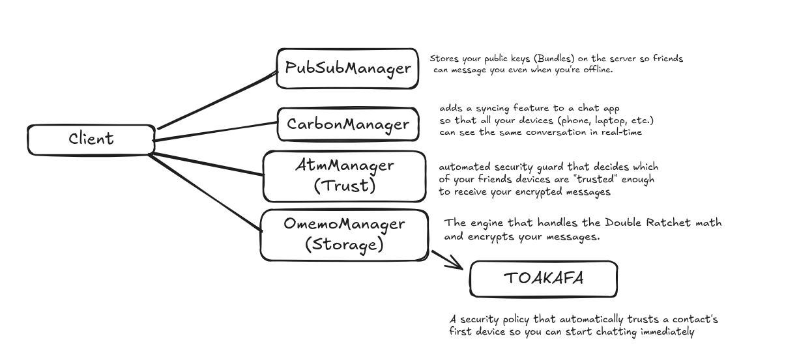

If you are building an XMPP client or bot today, plain text is no longer acceptable. Users expect modern, multi-device, end-to-end encryption. They expect **OMEMO (XEP-0384)**.

But OMEMO is not a simple "encrypt/decrypt" function. It is a complex state machine involving cryptographic ratchets, public key infrastructure, and device synchronization. Fortunately, libraries like **QXmpp** do the heavy lifting.

In this guide, we will tear down a fully functional C++ OMEMO Echo Bot. We will look at exactly how to implement the required extensions, manage trust, and handle encrypted payloads seamlessly.

---



## The Prerequisites (Laying the Groundwork)

Before we even touch encryption keys, we have to prepare the XMPP client to handle the _environment_ OMEMO lives in. OMEMO relies heavily on the server to distribute keys and synchronize devices.

In the constructor of our `echoClientOmemo` class, we add two vital extensions:

C++

```cpp
addNewExtension<QXmppPubSubManager>();
addNewExtension<QXmppCarbonManagerV2>();
```

### **Why are these mandatory?**

1. **PubSub (`QXmppPubSubManager`):** OMEMO is asynchronous. If you are offline, how does a friend start a secure chat with you? They need your public keys. OMEMO uses the server's **Publish-Subscribe (XEP-0060)** nodes to store your "Bundle" (your Identity Key and PreKeys). Without PubSub, OMEMO literally cannot perform its initial X3DH handshake.
    
2. **Message Carbons (`QXmppCarbonManagerV2`):** OMEMO is "Multi-End to Multi-End." If you send a message from your phone, you want to see that sent message on your laptop. Carbons (XEP-0280) tell the server to copy outgoing messages to your other devices.
    

---

## Trust & Identity Management

Encryption is useless if you are encrypting data for an impostor. Before we manage the cryptography, we must manage **Trust**.

C++

```cpp
auto *trustStorage = new QXmppAtmTrustMemoryStorage();
addNewExtension<QXmppAtmManager>(trustStorage);
```

### **The ATM Manager**

ATM stands for **Automatic Trust Management**. In OMEMO, every device has a unique "Fingerprint." The ATM manager is responsible for remembering which fingerprints belong to your friends and which ones are strangers.

In this example, we use `QXmppAtmTrustMemoryStorage()`. Because it's "Memory Storage," it starts with a blank slate every time the bot runs. _(Note: For a production app, you would swap this out for a SQLite database so trust is preserved between reboots)._

---

## The Cryptographic Engine (The Manager)

Now we arrive at the core of the protocol. We instantiate the OMEMO manager and its storage.

C++

```cpp
auto *omemoStorage = new QXmppOmemoMemoryStorage();
m_omemoManager = addNewExtension<QXmppOmemoManager>(omemoStorage);
```

### **Activating the Interceptor**

Adding the extension isn't enough. We have to tell the core XMPP client to actually _use_ it.

C++

```cpp
setEncryptionExtension(m_omemoManager);
```

This is a massive convenience provided by QXmpp. By setting this, the `m_omemoManager` acts as a middleware interceptor.

- When `send()` is called, the manager intercepts the plaintext, looks up the recipient's Device IDs (`rid`), performs the **Double Ratchet** encryption, wraps it in the `<encrypted>` XML element, and sends it.
    
- When an encrypted stanza arrives from the network, the manager decrypts it _before_ it triggers the `messageReceived` signal.
    

### **The TOAKAFA Security Policy**

C++

```cpp
m_omemoManager->setSecurityPolicy(QXmpp::Toakafa);
m_omemoManager->load();
```

Because this is an automated bot, it cannot ask a human to physically scan a QR code to verify a user's fingerprint. We use the **TOAKAFA** policy (_Trust Once And Keep Authenticating For Always_).

Under TOAKAFA (also known as BTBV - Blind Trust Before Verification), the bot will automatically trust the _first_ device it sees from a user. This allows the conversation to start smoothly. However, if that user suddenly adds a _second_ device, the ATM manager will flag it as untrusted, protecting the bot from unauthorized new endpoints.

Finally, `load()` pulls any existing cryptographic state (session keys, identity keys) from storage into active memory.

---

## The Network Handshake (setUp)

OMEMO requires your client to publish its keys to the server so others can find you. This cannot happen until you are actually connected to the XMPP server.

C++

```cpp
connect(this, &QXmppClient::connected, this, [this]() {
    m_omemoManager->setUp();
});
```

### **What `setUp()` Actually Does**

When `setUp()` is triggered, the QXmpp library performs several actions defined in XEP-0384:

1. **Device Announcement:** It generates a random 32-bit integer (your Device ID) and publishes it to the PEP node `urn:xmpp:omemo:2:devices`.
    
2. **Bundle Generation:** It generates your Ed25519 Identity Key, a Signed PreKey, and a batch of about 100 one-time PreKeys.
    
3. **Bundle Publication:** It wraps these keys into a `<bundle>` XML element and publishes them to the `urn:xmpp:omemo:2:bundles` node.
    

Once `setUp()` completes, your bot is officially ready to receive secure messages from anyone in the world.

---

## shHandling the Message Loop

Because we properly configured the `setEncryptionExtension`, the actual bot logic remains incredibly clean. It doesn't need to know anything about AES-256 or Elliptic Curves.

C++

```cpp
void echoClientOmemo::messageReceived(const QXmppMessage &message)
{
    // 1. Check for empty payloads
    if (message.body().isEmpty()) {
        return;
    }

    // 2. Echo the message back securely
    send(QXmppMessage({}, message.from(), u"Your message: " + message.body()));
}
```

### **The Importance of `isEmpty()`**

You might look at `if (message.body().isEmpty()) return;` and think it's just to stop the bot from replying to blank messages. But in OMEMO, this line is crucial.

According to the XEP-0384 specification, OMEMO frequently sends **Empty OMEMO Messages**. These are used for:

- **Heartbeats:** If you send 53 messages without a reply, the client sends an empty message to force the cryptographic ratchet to move forward.
    
- **Session Initialization:** When someone builds a new session with you, they often send an empty message just to complete the X3DH key exchange.
    

By returning early on empty bodies, your bot gracefully ignores these background cryptographic maintenance messages while still allowing the `m_omemoManager` to process the keys inside them.